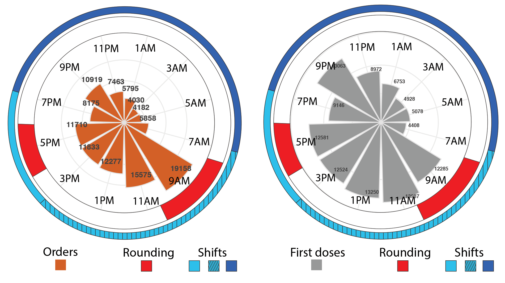

In a recent study <https://www.biorxiv.org/content/10.1101/617944v1>  we analyzed the daily distribution of ~120K doses of 12 separate drugs in ~1.5K inpatients at a major children’s hospital in the U.S. Treatment orders and administration (first-doses) were strongly time-of-day-dependent. These 24 h rhythms were consistent across drugs, diagnoses, and hospital units.

**This repository contains the code used for each part of this study.**

## Part 1. Extract EMR data from Epic
This repository describes how to extract patient data from Epic. Explain that some adaptation of this code may be necessary depending upon the Epic systems at user's institution.

## Part 2. Evaluate 24 h TREATMENT profile
Summarise the objective and methodology. Describe the code that is provided

## Part 3. Evaluate 24 h RESPONSE profile
Summarise the objective and methodology. Describe the code that is provided