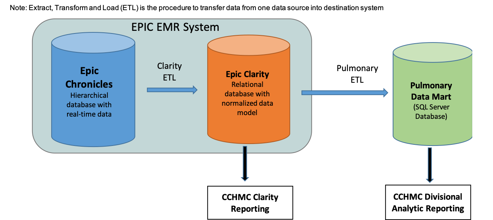

Tools to study round-the-clock hospital medicine
================
Marc Ruben
7/8/2019

**This repository describes the workflow (with code) for leveraging
electronic medical record (EMR) data to study treatment and response as
a function of time-of-day**

## Background

We analyzed the daily distribution of ~120K doses of 12 separate drugs
in ~1.5K inpatients at a major children’s hospital in the U.S. Treatment
orders and first-doses administered were strongly time-of-day-dependent
(figure below). These 24 h rhythms were consistent across drugs,
diagnoses, and hospital units.
<https://www.biorxiv.org/content/10.1101/617944v1>

<<<<<<< HEAD
Steps below describe how to reproduce these types of analyses.

## Part 1. Extract EMR data from Epic

Schematic (below) of how EMR data in Epic moves from Chronicles, to
Clarity, to CCHMC (Children’s Hospital Medical Center) divisional data
mart. Your code will need to reflect your institution’s pipeline for
Epic data.
=======
This repository contains descriptions (and code) to reproduce these
analyses.

## Part 1. Extract EMR data from Epic

The following diagram shows how data in Epic moves from Chronicles, to
Clarity, to divisional data mart. Code will need to be adapted to
institutional differences in how Epic data is maintained.
>>>>>>> 27d004df685cbcb1e66a2693c3b566b345ce3f54

## Part 2. Evaluate 24 h patterns in TREATMENT

Characterize the daily distribution of treatment orders and first-doses
administered. Requires R.

## Part 3. Evaluate 24 h patterns in RESPONSE

Characterize clinical responses as a function of time of day. Requires
R.
