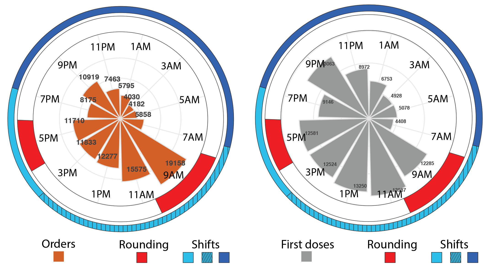

Tools to study round-the-clock hospital medicine
================
Marc Ruben
7/8/2019

**This repository describes the workflow (with code) for using
electronic medical record (EMR) data to study of treatment as a function
of time-of-day.**

## Background

We analyzed the daily distribution of ~120K doses of 12 separate drugs
in ~1.5K inpatients at a major children’s hospital in the U.S. Treatment
orders and first-doses administered were strongly time-of-day-dependent
(figure below). These 24 h rhythms were consistent across drugs,
diagnoses, and hospital units.
<https://www.biorxiv.org/content/10.1101/617944v1>

Steps below describe how to reproduce these types of analyses.

## Part 1. Extract EMR data from Epic

Schematic (below) of how EMR data in Epic moves from Chronicles, to
Clarity, to CCHMC (Children’s Hospital Medical Center) divisional data
mart. While different institutions maintain Epic data differently, the
key data elements (ie. patient variables of interest) required for this
study are provided in the data folder of this repository. This file also
contains all of the data necessary to run Parts 2 and 3 (below).

## Part 2. Evaluate 24 h patterns in TREATMENT

Characterize the daily distribution of treatment orders and first-doses
administered. Code provided. Requires R.

## Part 3. Evaluate 24 h patterns in RESPONSE

Characterize clinical responses as a function of time of day. Code
provided. Requires R.
